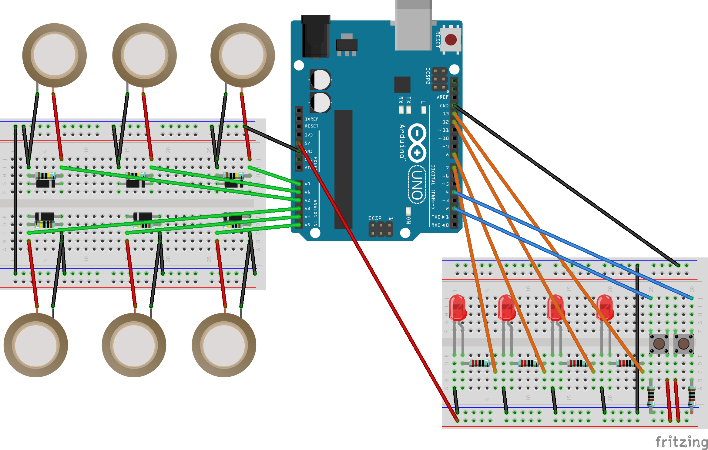

# arduino-drumkit
 An electronic drumkit made with an Arduino controller

# Original code
Inspired by this instructable by user anouskadg: https://www.instructables.com/MIDI-Arduino-Drums/
Originally adapted from Jenna deBoisblanc and Spiekenzie Labs initial code
https://www.instructables.com/Arduino-Xylophone/

# Adjustments made to original code:
- Mapping to Ugritone Kult Drums II notes (https://ugritone.com/products/kvlt-drums-ii)
- Added a pushbutton to change pin to note mapping
- Added a pushbutton to change output from midi channel 1 to 16
- Added 4 LEDs to show currently selected midi channel in binary

